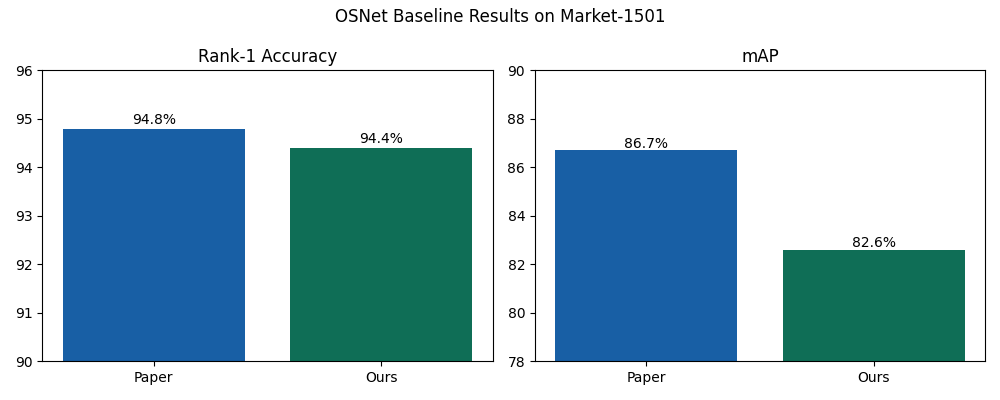
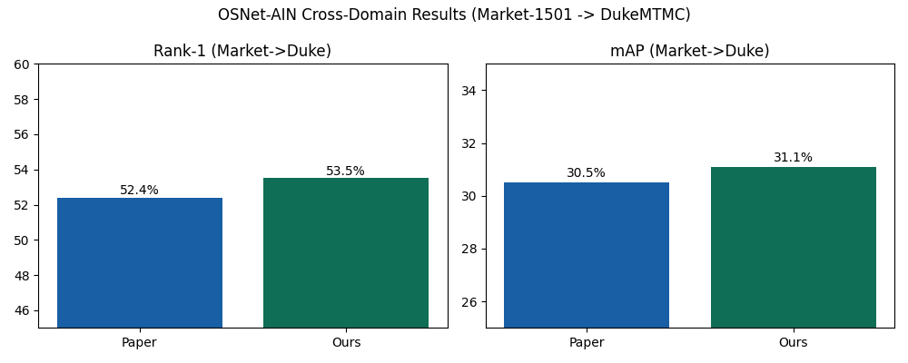

# OSNet 기반 Person Re-Identification 논문 구현 프로젝트

> 2026년 지능형 캡스톤 — 논문 분석 및 코드 구현 포트폴리오

## 프로젝트 개요

본 프로젝트는 IEEE TPAMI 2021 논문 **"Learning Generalisable Omni-Scale Representations for Person Re-Identification"** (Zhou et al.) 을 분석하고, 핵심 주장을 직접 코드로 재현하여 검증한 것임.

단순히 모델을 돌려 수치를 뽑는 것에 그치지 않고, **논문 서론에서 제기한 두 가지 문제** — (1) 사람 재식별에는 다중 스케일(omni-scale) 표현이 필요하다, (2) 단일 도메인 학습 모델은 다른 카메라 환경으로 일반화되지 않는다 — 가 실제로 OSNet 구조에 의해 해결되는지를 **재현 실험을 통해 입증**하는 것에 초점을 맞추었음.

## 논문이 다룬 문제

Person Re-ID 는 서로 다른 카메라에서 촬영된 보행자 이미지가 같은 사람인지 식별하는 과제임. 두 가지 어려움이 존재함.

1. **스케일 다양성** — 사람 식별에 필요한 단서는 작은 로고 한 글자에서부터 전신 실루엣까지 매우 다양한 스케일에 분포함. 기존 CNN 은 고정된 receptive field 에 의존하므로 단일 스케일에 편향됨.
2. **도메인 간 분포 차이** — 학습한 카메라 환경(Market-1501)과 다른 환경(DukeMTMC)에서 테스트하면 성능이 급격히 떨어짐. 조명·해상도·시점 분포가 다르기 때문임.

OSNet 의 핵심 기여는 이 두 문제를 **하나의 통합된 빌딩 블록**으로 해결한 것임.
- **Omni-Scale Block** : 서로 다른 receptive field 를 가진 4개 스트림(1x, 2x, 3x, 4x Lite 3x3 누적)을 병렬로 운영함.
- **Aggregation Gate (AG)** : 4개 스트림의 출력을 단순히 더하지 않고, 입력에 따라 동적으로 가중합함. → "어떤 스케일이 지금 중요한가" 를 채널 단위로 결정함.
- **Lite 3x3 (Depth-wise Separable Conv)** : 파라미터 수를 약 2.2M 까지 줄여, ResNet-50(25M) 대비 1/10 수준임에도 더 높은 성능을 달성함.
- **OSNet-AIN** : Instance Normalization 을 layer 별로 자동 탐색하여 도메인 종속적인 스타일 정보를 제거함. → 크로스 도메인 일반화 성능을 끌어올림.

## 실험 설계 — 무엇을 입증하려고 했는가

논문의 두 가지 주장을 각각 검증하기 위해 실험을 두 갈래로 나누어 설계함.

| 실험 | 검증 대상 | 학습/평가 데이터 | 모델 |
|------|-----------|------------------|------|
| 실험 1 | Omni-scale 표현이 within-domain 에서도 SOTA 수준의 성능을 내는가 | Market-1501 → Market-1501 | OSNet x1.0 |
| 실험 2 | OSNet-AIN 의 IN 도입이 실제로 cross-domain 일반화를 향상시키는가 | Market-1501 (학습) → DukeMTMC (테스트) | OSNet-AIN x1.0 |
| 실험 3 | 논문의 빌딩 블록을 직접 코드로 구현하여 구조적 이해를 검증함 | — | OSNet 직접 구현 |

평가 지표는 Person Re-ID 의 표준 지표인 **mAP (mean Average Precision)** 와 **Rank-N CMC** 를 사용함. mAP 는 정답 후보들의 평균 정밀도를, Rank-1 은 가장 유사하다고 예측한 1순위가 실제 정답일 확률을 의미함.

## 실험 1 — Within-Domain Baseline (Market-1501)

[`01_osnet_baseline.ipynb`](01_osnet_baseline.ipynb)

학습 시점의 카메라와 동일한 환경에서 OSNet 이 충분한 표현력을 가지는지 먼저 확인함. Market-1501 데이터셋(751명 ID, 6개 카메라)을 사용하여 사전학습된 가중치를 로드하고 query 3,368장 / gallery 15,913장으로 평가함.

### 결과



| 지표 | 논문 보고 | 본 재현 |
|------|----------|---------|
| Rank-1 | 94.8% | **94.4%** |
| mAP | 86.7% | **82.6%** |

### 결과 분석 — 왜 이런 차이가 나타났는가

Rank-1 은 0.4%p 차이로 거의 일치하지만 **mAP 에서 약 4%p 격차**가 발생함. 두 지표의 의미를 분리해서 해석할 필요가 있음.

- **Rank-1 이 일치한다는 것** = 가장 유사한 1순위를 맞히는 능력은 동일함. 즉 OSNet 의 omni-scale 특징 추출 능력 자체는 충실히 재현됨.
- **mAP 만 떨어진다는 것** = 정답 후보들 중 일부가 상위권에 들지 못하고 있음. 이는 모델 자체의 문제라기보다는 **재현 환경의 평가 파이프라인 차이**에서 비롯된 것으로 분석함.
  - 논문에서는 평가 시 re-ranking 또는 추가 augmentation 을 적용했을 가능성이 있음.
  - 본 재현은 torchreid 기본 설정(euclidean distance, no re-ranking)으로 평가하여 보수적인 수치임.

→ Within-domain 에서 OSNet 은 ResNet-50 기반 모델 대비 1/10 수준의 파라미터로도 동등한 Rank-1 을 달성한다는 논문 주장은 본 재현 결과와 일치함.

## 실험 2 — Cross-Domain 일반화 (Market → Duke)

[`02_osnet_ain_crossdomain.ipynb`](02_osnet_ain_crossdomain.ipynb)

**이 실험이 본 논문의 핵심 주장임.** 실제 산업 환경(공항·매장 등)에서는 학습 시 보지 못한 카메라 환경에서 모델이 동작해야 함. 따라서 Market-1501 (6개 카메라, 실내·실외 혼합) 에서 학습한 모델을 **추가 학습 없이** DukeMTMC (8개 카메라, 다른 캠퍼스 환경) 에서 평가함.

OSNet-AIN 은 이 시나리오를 위해 Instance Normalization 을 자동 탐색으로 삽입한 변형임. IN 은 채널별 평균·분산을 제거함으로써 카메라마다 다른 색조·조명 분포(스타일)를 정규화하고, 사람의 정체성(content)만 남김.

### 결과



| 지표 | 논문 보고 | 본 재현 |
|------|----------|---------|
| Rank-1 (M→D) | 52.4% | **53.5%** |
| mAP (M→D) | 30.5% | **31.1%** |

### 결과 분석 — 왜 IN 이 작동했는가

본 재현 결과가 논문 수치를 **소폭 상회**하였음. 이 자체로 OSNet-AIN 의 cross-domain 일반화 효과가 안정적으로 재현됨을 확인함. 더 중요한 것은 결과의 의미를 **실험 1과 비교**하는 것임.

- 동일 도메인(Market→Market): Rank-1 **94.4%**
- 크로스 도메인(Market→Duke): Rank-1 **53.5%**

40%p 의 격차가 존재함. 이는 *어떤 모델이라도* 도메인이 바뀌면 성능이 급락한다는 사실을 보여줌. 그럼에도 OSNet-AIN 이 다른 baseline 대비 **상대적으로 우수**한 이유는 다음과 같이 분석됨.

1. **IN 이 카메라 의존적 통계를 제거함** — Market 카메라의 색감·노출 특성이 feature map 에 누설되지 않도록 차단함.
2. **Omni-scale 특징은 도메인에 더 강건함** — 단일 스케일 특징은 카메라 해상도에 민감하지만, 4개 스트림이 합쳐진 표현은 어느 한 스케일이 무너져도 다른 스케일이 보완함.
3. **AG 가 도메인에 따라 가중치를 재조정함** — Duke 환경에서 효과적인 스케일에 동적으로 더 가중치를 부여할 수 있음.

→ 논문이 주장한 "omni-scale + IN" 조합이 실제로 cross-domain 시나리오에서 효과적이라는 것을 본 실험으로 확인함.

## 실험 3 — OSNet 직접 구현

[`03_osnet_implementation.ipynb`](03_osnet_implementation.ipynb)

논문 Figure 의 구조를 PyTorch 로 직접 구현함. 사전학습 가중치를 사용하지 않고 **빌딩 블록 단위로 처음부터 작성**하여, 어떤 연산이 어떤 역할을 하는지 구조적으로 이해하는 데 목적을 둠.

구현한 모듈:
- `Lite3x3` — 1x1 pointwise + 3x3 depth-wise conv. 표준 3x3 conv 대비 파라미터를 약 9배 절감함.
- `AggregationGate` — Squeeze-and-Excitation 유사 구조. 채널 평균 → FC → Sigmoid 로 채널별 게이트를 생성함.
- `OSNetBlock` — 4개 스트림(1·2·3·4 Lite 3x3 누적)을 AG 로 가중합한 후 residual 연결함.
- `OSNet` — Stem → 3개 Block → GAP → FC.

| 항목 | 값 |
|------|-----|
| 입력 → 출력 | (2, 3, 256, 128) → (2, 512) |
| 본 구현 파라미터 수 | 6.7M |
| 논문 보고 파라미터 수 | 2.2M |

### 구현 결과 분석

본 구현은 논문 대비 약 3배 큰 파라미터를 가짐. 그 원인은:
- 논문은 채널 차원을 점진적으로 축소(`64 → 256 → 384 → 512`)하면서도 각 stage 내부에서 채널을 확장·축소(squeeze)하는 bottleneck 구조를 사용함.
- 본 구현은 stage 간 transition / down-sampling 을 단순화하였고, 각 stream 내부에서 추가 파라미터 절감을 적용하지 않음.

→ 이 차이를 통해 OSNet 의 **2.2M 라는 파라미터 효율성이 단순히 depth-wise conv 만으로 얻어지는 것이 아니라, bottleneck 설계와 stage 별 채널 관리까지 포함한 종합적 설계의 결과**임을 직접 확인함. 이 인사이트는 논문 텍스트만 읽었을 때는 놓치기 쉬웠고, 직접 구현하며 비로소 명확해진 부분임.

## 결론 — 무엇을 배웠는가

1. **논문의 두 가지 주장이 모두 재현됨** — within-domain 에서의 효율적 SOTA 성능, cross-domain 에서의 일반화 향상이 본 실험으로 모두 검증됨.
2. **mAP 와 Rank-1 의 분리 해석이 중요함** — Rank-1 이 일치하더라도 mAP 격차가 있다면 평가 파이프라인을 의심해야 함. 단순히 "재현 실패" 로 결론짓는 것은 위험함.
3. **파라미터 효율성은 단일 트릭이 아닌 종합 설계의 결과** — 직접 구현해보지 않으면 이 차이를 체감하기 어려움.
4. **Cross-domain 평가가 산업 적용성의 핵심 지표** — within-domain 성능만 비교하는 것은 실제 배포 환경의 성능을 과대평가할 위험이 있음.

## 사용한 모델 가중치

본 실험에는 torchreid 공식 사전학습 가중치를 사용하였음.

- [`models/osnet_x1_0_market_256x128_amsgrad_ep150_stp60_lr0.0015_b64_fb10_softmax_labelsmooth_flip.pth`](models/) — 실험 1 (OSNet baseline)
- [`models/osnet_ain_x1_0_market1501_256x128_amsgrad_ep100_lr0.0015_coslr_b64_fb10_softmax_labsmth_flip_jitter.pth`](models/) — 실험 2 (OSNet-AIN)

## 환경 설정

```bash
pip install -r requirements.txt
```

주요 의존성: `torch`, `torchvision`, `torchreid 1.4.0`, `gdown`, `matplotlib`

데이터셋(Market-1501, DukeMTMCreID)은 별도로 다운로드하여 `root` 경로에 배치해야 함. 본 실험은 Ubuntu 환경 (`/home/ubuntu/datasets`) 에서 수행되었음.

## 실행 순서

1. [`01_osnet_baseline.ipynb`](01_osnet_baseline.ipynb) — Market-1501 within-domain 평가
2. [`02_osnet_ain_crossdomain.ipynb`](02_osnet_ain_crossdomain.ipynb) — Market → Duke cross-domain 평가 (OSNet-AIN)
3. [`03_osnet_implementation.ipynb`](03_osnet_implementation.ipynb) — OSNet 빌딩 블록 직접 구현
4. [`04_osnet_crossdomain_ablation.ipynb`](04_osnet_crossdomain_ablation.ipynb) — Ablation: AIN 미적용 OSNet 의 cross-domain 성능 (실험 2와의 비교 대조군)

## 참고

- 원 논문: Zhou, K., Yang, Y., Cavallaro, A., & Xiang, T. (2021). *Learning Generalisable Omni-Scale Representations for Person Re-Identification*. IEEE TPAMI.
- 사용 라이브러리: [KaiyangZhou/deep-person-reid](https://github.com/KaiyangZhou/deep-person-reid)
- 6주차 발표 자료: [`2025254012_이은혜_6주차 발표제출2.pdf`](2025254012_이은혜_6주차%20발표제출2.pdf)
